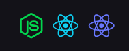

  

# Projeto de certificação do bootcamp Rocketseat

- Desafio Final - Gympoint

## Organização

1. Backend em Node.js [README](./backend/README.md)
2. Frontend em React [README](./frontend/README.md)
3. Mobile (Android) em React Native [README](./mobile/README.md)

  

- Agradecimento mais do que especial a [@mourabraz](https://github.com/mourabraz) que me ajudou DEMAIS nesse projeto tirando várias e várias dúvidas que me deixaram travado por muuuuitas horas sem sair do lugar. Sem ele com certeza eu não teria conseguido.
